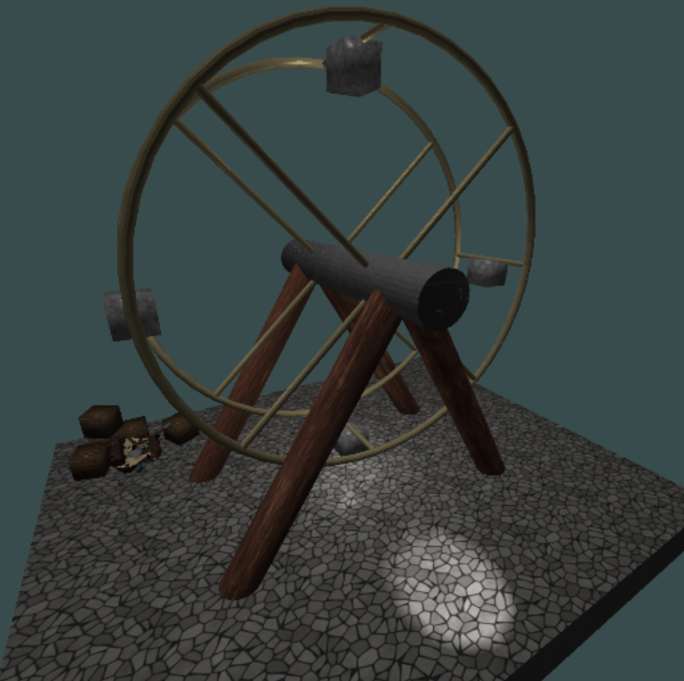

# Ferris Wheel in OpenGL
This project was made for my university coursework, using OpenGL to create a fairground ride from scratch. 

## How It's Made:
**Language:** C++
**Libraries Used:** Assimp, GLAD, GLFW, GLM, STB

To be continued...

